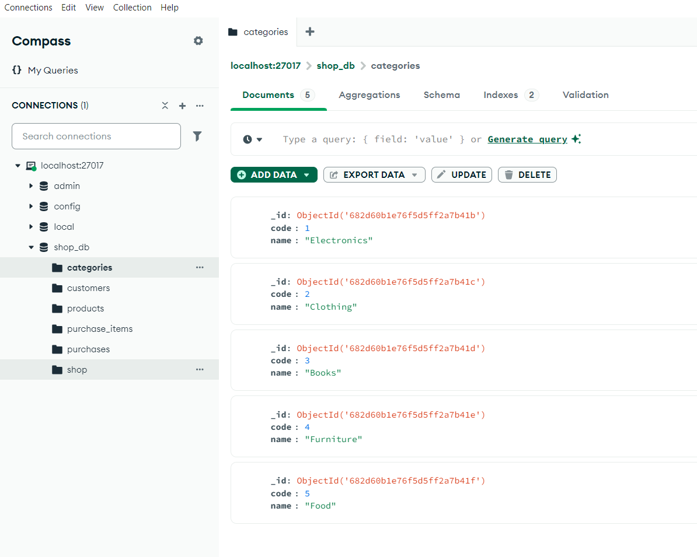

# Лабораторная работа №11
## Работа с NoSQL базами данных

## 1. Установка и настройка Redis

### Установка сервера Redis
```bash
# Обновление списка пакетов
sudo apt update

# Установка Redis
sudo apt install redis-server

# Проверка статуса сервиса
sudo systemctl status redis

# Настройка Redis для запуска при старте системы
sudo systemctl enable redis
```

### Установка клиента Redis
```bash
# Клиент Redis уже установлен вместе с сервером
# Использование командной строки для работы с Redis
redis-cli
```

## 2. Тестирование Redis

### Тестовый скрипт для Redis
```bash
#!/bin/bash

# Проверка соединения с Redis
echo "Проверка соединения с Redis..."
redis-cli ping
if [ $? -ne 0 ]; then
    echo "Ошибка: Не удалось подключиться к Redis"
    exit 1
fi

# Тестирование строк
echo -e "\nТестирование строк..."
redis-cli SET user:1:name "Иван Иванов"
redis-cli SET user:1:age 30
echo "Получаем имя: $(redis-cli GET user:1:name)"
echo "Получаем возраст: $(redis-cli GET user:1:age)"

# Тестирование списков
echo -e "\nТестирование списков..."
redis-cli DEL users
redis-cli RPUSH users "Алексей"
redis-cli RPUSH users "Мария"
redis-cli RPUSH users "Анна"
echo "Количество пользователей: $(redis-cli LLEN users)"
echo "Список пользователей: $(redis-cli LRANGE users 0 -1)"

# Тестирование множеств
echo -e "\nТестирование множеств..."
redis-cli DEL fruits
redis-cli SADD fruits "яблоко"
redis-cli SADD fruits "банан"
redis-cli SADD fruits "апельсин"
echo "Фрукты в множестве: $(redis-cli SMEMBERS fruits)"
echo "Проверяем наличие яблока: $(redis-cli SISMEMBER fruits яблоко)"
echo "Проверяем наличие груши: $(redis-cli SISMEMBER fruits груша)"

echo -e "\nВсе тесты завершены успешно!"
```

## 3. Работа с MongoDB

### Структура данных

База данных состоит из следующих коллекций:

1. **categories** - категории товаров
```json
{
    "code": Number,          // Уникальный код категории
    "name": String           // Название категории
}
```

2. **customers** - покупатели
```json
{
    "id": Number,           // Уникальный ID покупателя
    "name": String          // Имя покупателя
}
```

3. **products** - товары
```json
{
    "id": Number,           // Уникальный ID товара
    "name": String,         // Название товара
    "price": Number,        // Цена товара
    "category_code": Number // Код категории товара
}
```

4. **purchases** - покупки
```json
{
    "id": Number,           // Уникальный ID покупки
    "customer_id": Number,  // ID покупателя
    "date": Date,           // Дата покупки
    "price": Number         // Общая стоимость покупки
}
```

5. **purchase_items** - позиции покупок
```json
{
    "purchase_id": Number,   // ID покупки
    "product_id": Number,    // ID товара
    "amount": Number,        // Количество товара
    "inorder_price": Number  // Цена товара в заказе
}
```

### Запросы к MongoDB

#### Запрос 1 - Категории покупок клиента "Иван Иванов"
```python
# Категории покупок клиента
pipeline = [
    {"$match": {"name": "Иван Иванов"}},
    {"$lookup": {
        "from": "purchases",
        "localField": "id",
        "foreignField": "customer_id",
        "as": "purchases"
    }},
    {"$unwind": "$purchases"},
    {"$lookup": {
        "from": "purchase_items",
        "localField": "purchases.id",
        "foreignField": "purchase_id",
        "as": "items"
    }},
    {"$unwind": "$items"},
    {"$lookup": {
        "from": "products",
        "localField": "items.product_id",
        "foreignField": "id",
        "as": "products"
    }},
    {"$unwind": "$products"},
    {"$lookup": {
        "from": "categories",
        "localField": "products.category_code",
        "foreignField": "code",
        "as": "categories"
    }},
    {"$unwind": "$categories"},
    {"$group": {
        "_id": "$categories.name",
        "count": {"$sum": 1}
    }},
    {"$project": {
        "_id": 0,
        "category_name": "$_id",
        "count": 1
    }}
]

result = db.customers.aggregate(pipeline)
```

Результат:
```
{'count': 278, 'category_name': 'Электроника'}
{'count': 258, 'category_name': 'Одежда'}
{'count': 299, 'category_name': 'Мебель'}
{'count': 166, 'category_name': 'Продукты'}
{'count': 172, 'category_name': 'Книги'}
```

#### Запрос 2 - Продажи по категориям по месяцам за последний год
```python
# Продажи по категориям по месяцам
pipeline = [
    {"$match": {
        "date": {"$gte": datetime(last_year, 1, 1), "$lt": datetime(current_year, 1, 1)}
    }},
    {"$lookup": {
        "from": "purchase_items",
        "localField": "id",
        "foreignField": "purchase_id",
        "as": "items"
    }},
    {"$unwind": "$items"},
    {"$lookup": {
        "from": "products",
        "localField": "items.product_id",
        "foreignField": "id",
        "as": "products"
    }},
    {"$unwind": "$products"},
    {"$lookup": {
        "from": "categories",
        "localField": "products.category_code",
        "foreignField": "code",
        "as": "categories"
    }},
    {"$unwind": "$categories"},
    {"$group": {
        "_id": {
            "month": {"$month": "$date"},
            "year": {"$year": "$date"},
            "category": "$categories.name"
        },
        "total_sales": {"$sum": {"$multiply": ["$items.amount", "$products.price"]}}
    }}
]

result = db.purchases.aggregate(pipeline)
```

Результат выполнения в монго дб:
```
Query 1 - Categories purchased by 'иван иванов':
{'count': 278, 'category_name': 'Электроника'}
{'count': 258, 'category_name': 'Одежда'}
{'count': 199, 'category_name': 'Мебель'}
{'count': 166, 'category_name': 'Продукты'}
{'count': 172, 'category_name': 'Книги'}

Query 2 - Monthly sales by category for last year:
{'total_sales': 9618.119999999999, 'month_name': 'April', 'category_name': 'Одежда', 'year': 2024}
{'total_sales': 444.82000000000005, 'month_name': 'April', 'category_name': 'Продукты', 'year': 2024}
{'total_sales': 20548.81, 'month_name': 'April', 'category_name': 'Мебель', 'year': 2024}
{'total_sales': 167898.18, 'month_name': 'April', 'category_name': 'Электроника', 'year': 2024}
{'total_sales': 4298.78, 'month_name': 'April', 'category_name': 'Книги', 'year': 2024}
...
```

#### Запрос 3 - Топ-5 товаров по количеству продаж
```python
# Топ-5 товаров
pipeline = [
    {"$group": {
        "_id": "$product_id",
        "amount": {"$sum": "$amount"}
    }},
    {"$lookup": {
        "from": "products",
        "localField": "_id",
        "foreignField": "id",
        "as": "product"
    }},
    {"$unwind": "$product"},
    {"$project": {
        "name": "$product.name",
        "amount": 1
    }},
    {"$sort": {"amount": -1}},
    {"$limit": 5}
]

result = db.purchase_items.aggregate(pipeline)
```

Результат:
```
{'name': 'Наушники', 'amount': 1575}
{'name': 'Кресло', 'amount': 1567}
{'name': 'Роман', 'amount': 1551}
{'name': 'Платье', 'amount': 1531}
{'name': 'Ноутбук', 'amount': 1530}
```



## Выводы

В ходе лабораторной работы были изучены основные принципы работы с NoSQL базами данных Redis и MongoDB. Были реализованы основные операции с различными типами данных в Redis (строки, списки, множества) и выполнены агрегационные запросы в MongoDB для анализа данных о продажах.

Redis показал свою эффективность для работы с простыми структурами данных и кэшированием, в то время как MongoDB оказалась более подходящей для хранения и анализа сложных документов с вложенными структурами данных.

В MongoDB были реализованы следующие возможности:
1. Создание индексов для ускорения поиска
2. Использование агрегационных запросов для сложного анализа данных
3. Обработка связанных данных через операции join
4. Группировка и сортировка результатов запросов