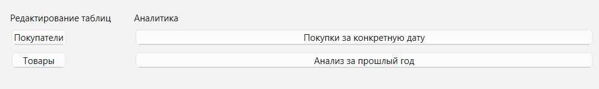
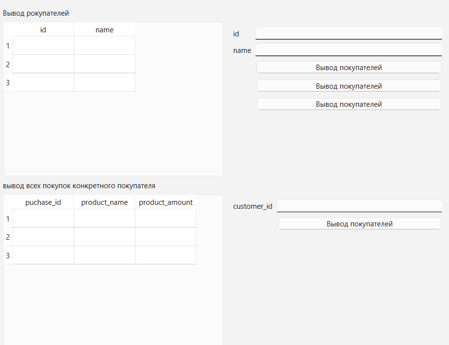
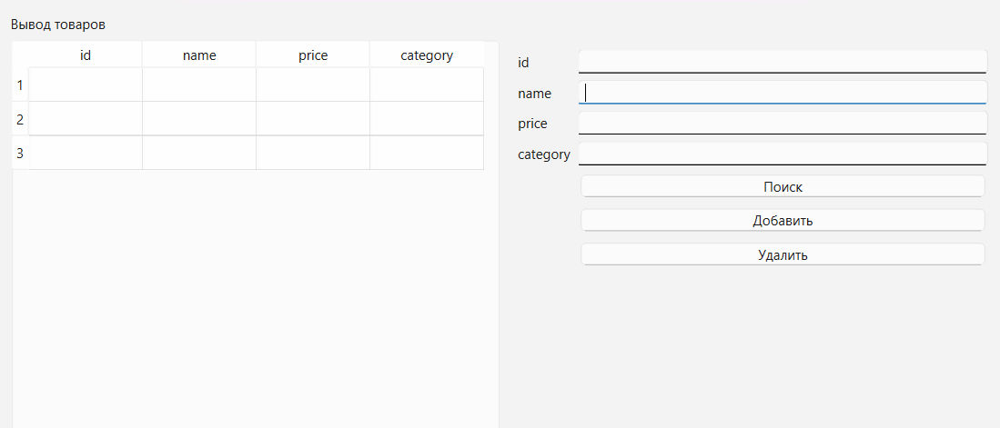
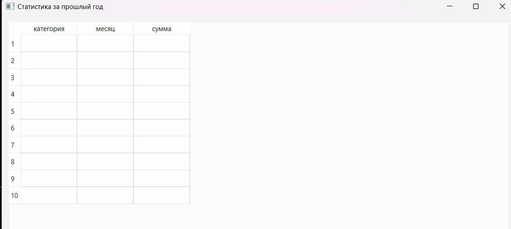
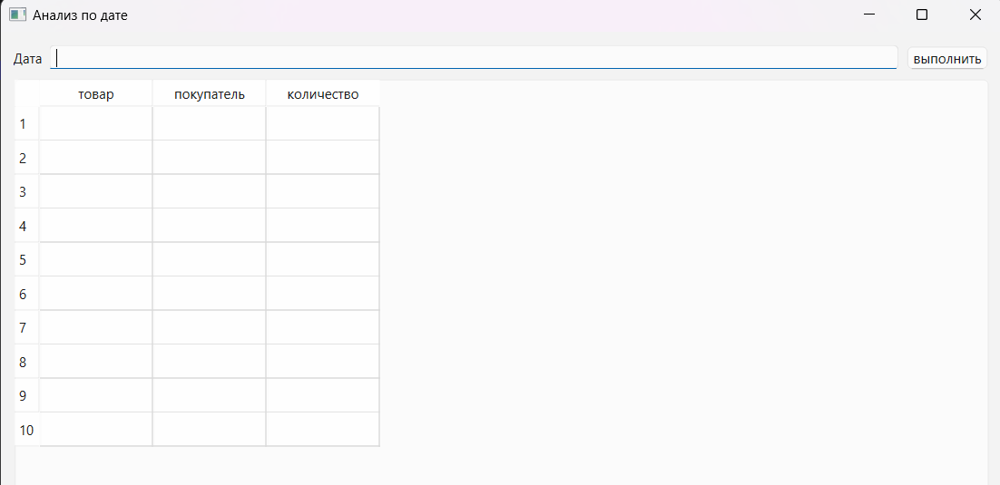

### **1. Описание пользователей информационной системы (ИС)**

Информационная система ориентирована на работу сотрудников магазина и, возможно, руководства. Выделим основные категории пользователей:

#### **1.1. Операторы (кассиры / менеджеры по продажам)**

* **Задачи**: ввод данных о новых покупках, регистрация новых покупателей, уточнение информации о товарах.
* **Права доступа**: ограниченные – только ввод и просмотр данных без возможности удаления или редактирования информации о товарах и категориях.

#### **1.2. Администраторы системы**

* **Задачи**: настройка справочников (товары, категории), управление пользователями системы.
* **Права доступа**: полный доступ ко всем функциям, включая удаление и изменение данных.

#### **1.3. Аналитики / Руководство**

* **Задачи**: выполнение аналитических запросов, получение статистики по продажам, анализ покупательского поведения.
* **Права доступа**: доступ к отчётам и статистике, без возможности редактирования.

---

### **2. Тип пользовательского интерфейса**

Исходя из характера работы пользователей (в основном стационарная работа в магазине, с клавиатурой и мышью), оптимальным является **десктопный графический пользовательский интерфейс (GUI)**.

**Причины выбора:**

* Повышенная надёжность и скорость работы;
* Поддержка работы с большим количеством данных;
* Возможность удобного вывода таблиц, фильтров и графиков;
* Удобство в интеграции с локальной БД.

---

### **3. Требования к пользовательскому интерфейсу**

#### **3.1. Общие требования**

* Поддержка авторизации и разграничения прав доступа;
* Удобная навигация между модулями;
* Интуитивно понятный дизайн;
* Проверка данных при вводе (валидация).

#### **3.2. Требования к модулю "Покупатели"**

* Просмотр списка покупателей;
* Добавление нового покупателя;
* Поиск по имени / e-mail / ID;
* Вывод истории покупок конкретного покупателя.

#### **3.3. Требования к модулю "Товары"**

* Просмотр списка товаров с указанием категории и цены;
* Добавление нового товара;
* Фильтрация по категории, сортировка по цене;
* Поиск по названию или категории.

#### **3.4. Требования к модулю "Покупки"**

* Ввод данных о новой покупке (покупатель, товар, дата, количество);
* Просмотр истории покупок по дате;
* Поиск и фильтрация покупок по дате, покупателю, товару;
* Автоматическое вычисление суммы покупки.

#### **3.5. Требования к модулю аналитики (запросы)**

Интерфейс должен обеспечивать доступ к следующим предопределённым запросам:

1. **Какие товары покупали сегодня**

    * Интерфейс: выпадающий список с датой (по умолчанию — сегодняшняя);
    * Таблица с результатами: товар, покупатель, количество.

2. **Кто из покупателей совершил покупки на наибольшую сумму в прошлом году**

    * Кнопка "Выполнить запрос";
    * Таблица: покупатель, сумма покупок.

3. **Какой товар самый дорогой**

    * Отображение одного товара или списка при одинаковой цене.

4. **Расширенный запрос: список категорий и количество товаров в каждой**

    * Таблица: категория, количество товаров;
    * Возможность выгрузки в Excel.

### 4. Реализация
главная страница

Модуль клиентов

Модуль товаров

Статистика за прошлый год

Модуль анализа по дате

