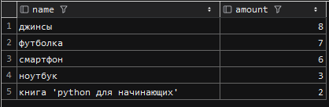
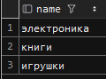
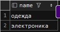
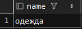
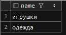
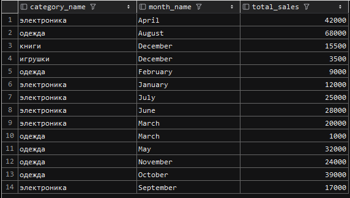

## Отчет по лабораторной работе №2
## По предмету: «Базы данных и информационные системы»
### Вариант 12

Студ. Сесюкалов А.А. А-14-21. 
Рук. Шевченко И.В.

---

# Содержание
* [1. Запрос на выборку топ 5 продуктов](../src/query/top5_products_by_popularity.sql)
* [2. Запрос на получение всех категорий которые покупал человек Х](../src/query/from_which_category_bought_X.sql)
* [3. Запрос на получение статистики за последний год](../src/query/last_year_statistic.sql)
* [4. Результаты вызова](#результаты-вызова)  
  [Файл заполнения тестовыми примерами](../src/query_test/fill_test_query.sql) 
  [Код модели](../src/mpei_control_db_model/dbmodel.sql) 
  [Общее задание](../README.md)
---

# Результаты вызова
#### Запрос на выбор топ 5 продуктов

#### Запрос на получение всех категорий которые покупал человек Х
* Иван Иванов 

* Пётр Петров 

* Анна Сидорова 

* Мария Смирнова 

#### Запрос на получение статистики за последний год
