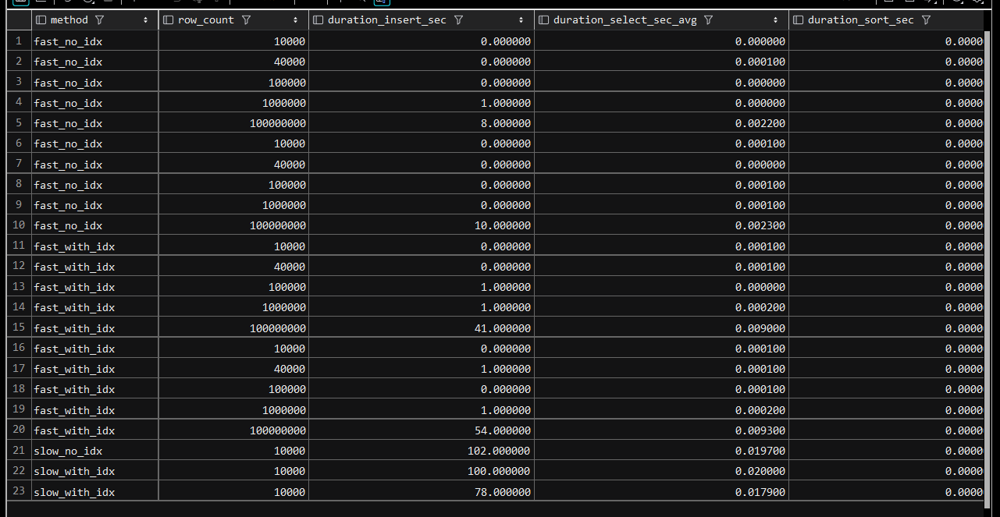

# Лабораторная работа №9: Генерация данных, индексы и производительность

## 1. Генерация больших объёмов данных1

### 1.1. Функции генерации больших объёмов данных с поэлементной вставкой 

```sql
DROP PROCEDURE IF EXISTS generate_data_slow$$
CREATE PROCEDURE generate_data_slow(IN p_num_rows INT)
BEGIN
    DECLARE v_i INT DEFAULT 1;
    DECLARE v_rand INT;
    DECLARE v_str VARCHAR(100);
CREATE TABLE IF NOT EXISTS large_table_slow (
                                                id INT AUTO_INCREMENT PRIMARY KEY,
                                                numeric_value INT,
                                                string_value VARCHAR(100),
    created_at TIMESTAMP DEFAULT CURRENT_TIMESTAMP
    );
TRUNCATE TABLE large_table_slow;
WHILE v_i <= p_num_rows DO
        SET v_rand = FLOOR(RAND() * 1000000);
        SET v_str = CONCAT('String_', MD5(RAND()));
INSERT INTO large_table_slow (numeric_value, string_value) VALUES (v_rand, v_str);
SET v_i = v_i + 1;
END WHILE;
END$$
DELIMITER ;
```

### 1.2. Функции генерации больших объёмов данных с индексами и поэлементной вставкой

```sql
DROP PROCEDURE IF EXISTS generate_data_slow_with_index$$
CREATE PROCEDURE generate_data_slow_with_index(IN p_num_rows INT)
BEGIN
    DECLARE v_i INT DEFAULT 1;
    DECLARE v_rand INT;
    DECLARE v_str VARCHAR(100);
CREATE TABLE IF NOT EXISTS large_table_slow_indexed (
                                                        id INT AUTO_INCREMENT PRIMARY KEY,
                                                        numeric_value INT,
                                                        string_value VARCHAR(100),
    created_at TIMESTAMP DEFAULT CURRENT_TIMESTAMP,
    INDEX idx_numeric (numeric_value),
    INDEX idx_string (string_value),
    INDEX idx_comp (numeric_value, string_value)
    );
TRUNCATE TABLE large_table_slow_indexed;
WHILE v_i <= p_num_rows DO
        SET v_rand = FLOOR(RAND() * 1000000);
        SET v_str = CONCAT('String_', MD5(RAND()));
INSERT INTO large_table_slow_indexed (numeric_value, string_value) VALUES (v_rand, v_str);
SET v_i = v_i + 1;
END WHILE;
END$$
DELIMITER ;
```

### 1.3. Функции генерации больших объёмов данных с вставкой блоками

```sql
DROP PROCEDURE IF EXISTS generate_data_fast$$
CREATE PROCEDURE generate_data_fast(IN p_num_rows INT)
BEGIN
    DECLARE v_i INT DEFAULT 1;
    DECLARE v_rand INT;
    DECLARE v_str VARCHAR(100);
CREATE TABLE IF NOT EXISTS large_table_fast (
                                                id INT AUTO_INCREMENT PRIMARY KEY,
                                                numeric_value INT,
                                                string_value VARCHAR(100),
    created_at TIMESTAMP DEFAULT CURRENT_TIMESTAMP
    );
TRUNCATE TABLE large_table_fast;
WHILE v_i <= p_num_rows DO
        SET v_rand = FLOOR(RAND() * 1000000);
        SET v_str = CONCAT('String_', MD5(RAND()));
INSERT INTO large_table_fast (numeric_value, string_value) VALUES (v_rand, v_str);
SET v_i = v_i + 1;
END WHILE;
END$$
DELIMITER ;
```

### 1.4. Функции генерации больших объёмов данных с индексами и вставкой блоками

```sql
DROP PROCEDURE IF EXISTS generate_data_fast_with_index$$
CREATE PROCEDURE generate_data_fast_with_index(IN p_num_rows INT)
BEGIN
    DECLARE v_i INT DEFAULT 1;
    DECLARE v_rand INT;
    DECLARE v_str VARCHAR(100);
CREATE TABLE IF NOT EXISTS large_table_fast_indexed (
                                                        id INT AUTO_INCREMENT PRIMARY KEY,
                                                        numeric_value INT,
                                                        string_value VARCHAR(100),
    created_at TIMESTAMP DEFAULT CURRENT_TIMESTAMP,
    INDEX idx_numeric (numeric_value),
    INDEX idx_string (string_value),
    INDEX idx_comp (numeric_value, string_value)
    );
TRUNCATE TABLE large_table_fast_indexed;
WHILE v_i <= p_num_rows DO
        SET v_rand = FLOOR(RAND() * 1000000);
        SET v_str = CONCAT('String_', MD5(RAND()));
INSERT INTO large_table_fast_indexed (numeric_value, string_value) VALUES (v_rand, v_str);
SET v_i = v_i + 1;
END WHILE;
END$$
DELIMITER ;
```

## 2. Тестирование
Тестирование проводиться засечками времени на заполнение таблицы. Высчитывается среднее время доступа запроса SELECT по 10000 различных разпросов с условием и без условия. А также сортировка. Результаты сведены в таблицу



Скрипт тестирования
```sql
DELIMITER $$

-- Вспомогательная процедура для запуска генераторов
DROP PROCEDURE IF EXISTS run_generator$$
CREATE PROCEDURE run_generator(
    IN method_part VARCHAR(50),
    IN with_index BOOLEAN,
    IN multiplier INT,
    IN base_rows INT
)
BEGIN
    DECLARE t0 DATETIME;
    DECLARE t1 DATETIME;
    DECLARE t2 DATETIME;
    DECLARE t3 DATETIME;
    DECLARE t4 DATETIME;
    DECLARE t5 DATETIME;
    DECLARE proc_name VARCHAR(100);
    DECLARE rows_to_generate INT;
    DECLARE method_name VARCHAR(50);
    DECLARE table_name VARCHAR(50);

    SET rows_to_generate = base_rows * multiplier;
    SET method_name = CONCAT(
            method_part,
            CASE when with_index THEN '_with_idx' ELSE '_no_idx' END
                      );

    SET table_name = CONCAT('large_table_', method_part, IF(with_index, '_indexed', ''));

    -- Формируем имя вызываемой процедуры
    SET proc_name = CONCAT('generate_data_', method_part);
    IF with_index THEN
        SET proc_name = CONCAT(proc_name, '_with_index');
    END IF;

    -- Вызываем целевую процедуру
    SET t0 = NOW();
    SET @sql = CONCAT('CALL ', proc_name, '(?);');
    PREPARE stmt FROM @sql;
    SET @rows_param = rows_to_generate;
    EXECUTE stmt USING @rows_param;
    DEALLOCATE PREPARE stmt;
    SET t1 = NOW();

    -- Бенчмарк: доступ к таблице
    SET @s = CONCAT('INSERT INTO temp_bench (dummy) SELECT 1 FROM ', table_name, ' WHERE numeric_value > ?');
    PREPARE stmt FROM @s;

    SET @sum = 0;
    SET @cnt = 0;
    WHILE @cnt < 10000 DO
        SET @p = FLOOR(RAND() * 1000000);
        SET t2 = NOW();
        EXECUTE stmt USING @p;
        SET t3 = NOW();
        SET @sum = @sum + TIMESTAMPDIFF(SECOND, t2, t3);
        SET @cnt = @cnt + 1;
    END WHILE;
    SET @avg = @sum / @cnt;

    DEALLOCATE PREPARE stmt;

    -- отключим вывод
    SET @old_sql_log_bin = @@sql_log_bin;
    SET sql_log_bin = 0;

    -- Бенчмарк: сортировка
    SET @s = CONCAT('INSERT INTO temp_bench (dummy) SELECT 1 FROM ', table_name, ' ORDER BY numeric_value');
    PREPARE stmt FROM @s;
    SET t4 = NOW();
    EXECUTE stmt;
    SET t5 = NOW();

    -- включим вывод
    SET sql_log_bin = @old_sql_log_bin;
    -- Сохраняем результаты
    INSERT INTO generation_report (method, row_count, duration_insert_sec, duration_select_sec_avg, duration_sort_sec)
    VALUES (
               method_name,
               rows_to_generate,
               TIMESTAMPDIFF(SECOND, t0, t1),
 @avg,
            TIMESTAMPDIFF(SECOND , t4, t5)
           );
END$$
DELIMITER ;
```